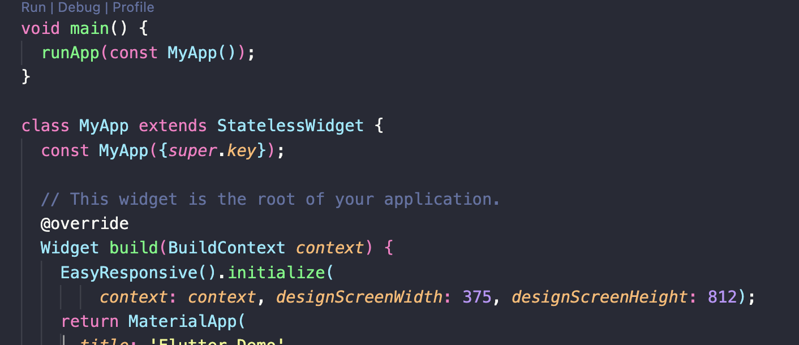
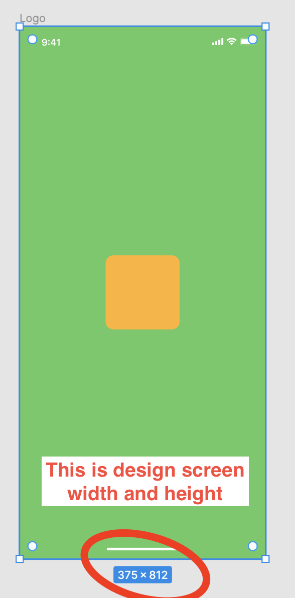

## Flutter easy_responsive
Easy calculate the width and height of the widget from figma design

### Configuration
Install the package
```dart
    flutter pub add easy_responsive
```

Import the package
```dart
    import 'package:easy_responsive/easy_responsive.dart';
```
You must call the initialization function before use the package.
```dart
    EasyResponsive().initialize(
        context: context, designScreenWidth: 375, designScreenHeight: 812);
```
like this:

You can get the design screen width and height like this:

Then, please use the width and height of the figma design with `.w` and `.h`
like this:
```dart
    Container(
        color: Colors.red,
        width: 120.w,
        height: 120.h,
        child:...
    )
```
If the width and height in the design equal, consider to use one of the `.w` or `.h` properties for both. Please ask the designer for the constrain of the width and height.